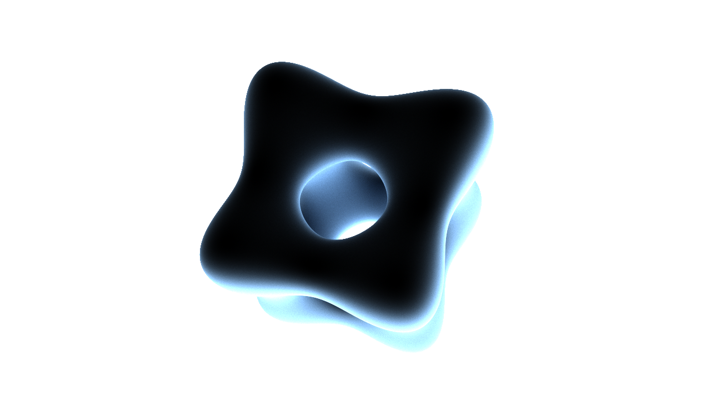

Raytracer
=========

A raytracer that uses path tracing for realistic lighting.

Scene descriptions are loaded from JSON files. Objects currently supported include spheres, planes and rectangles.
Surface properties that are supported include colour, emittance (for objects that act as light sources), reflectance,
diffuse reflectance, and transmittance w/ refractive index.

Sample renders:

